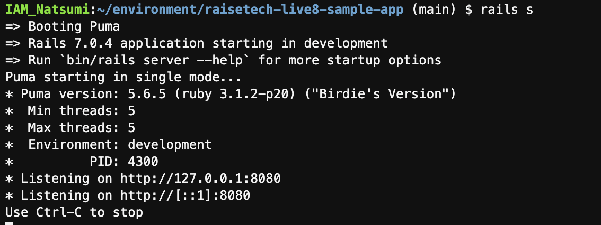
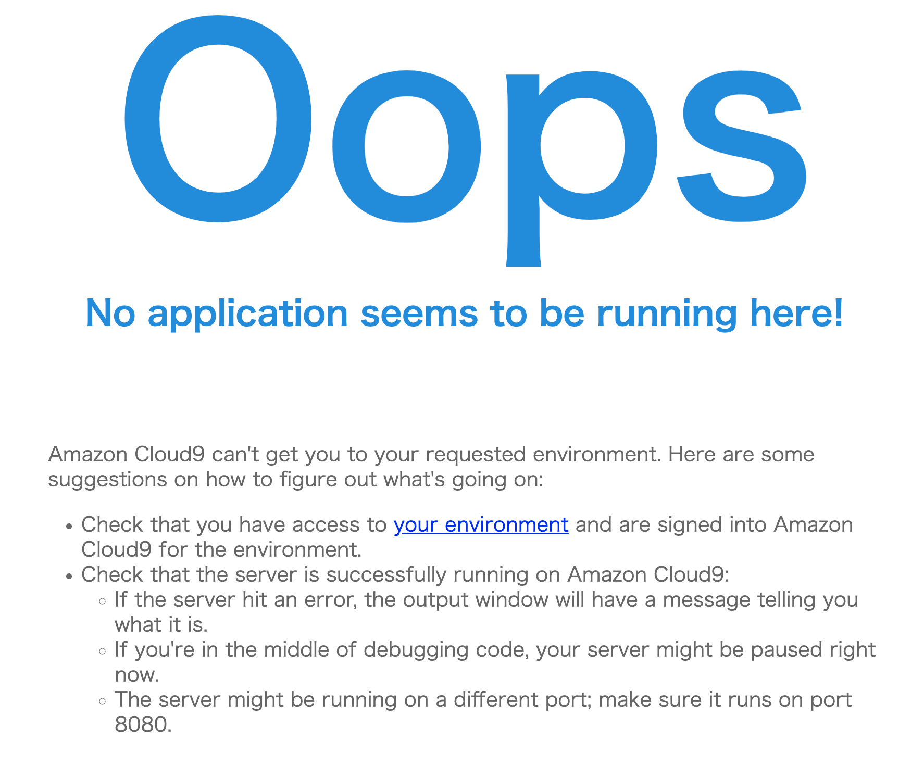
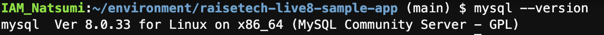
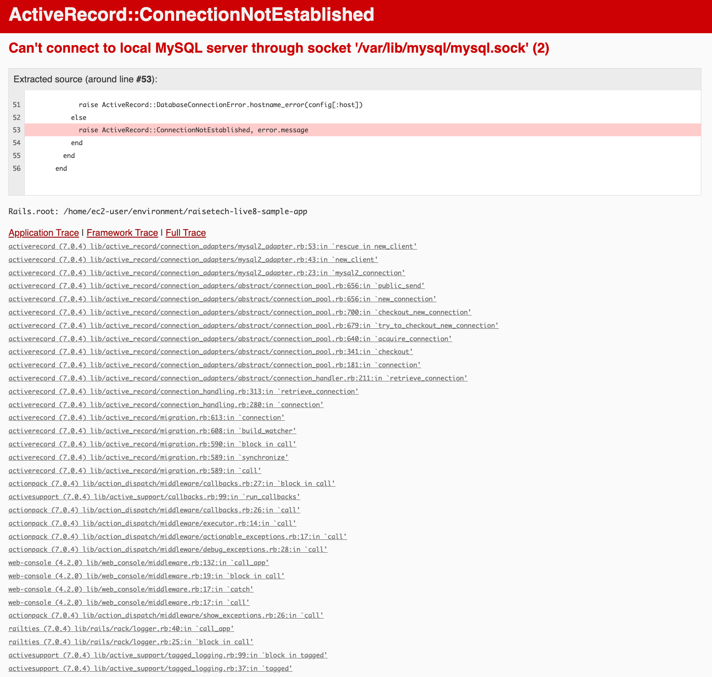

# 第3回課題

## AP サーバーについて調べてみましょう。AP サーバーの名前とバージョンを確認してみましょう。AP サーバーを終了させた場合、引き続きアクセスできますか？結果を確認して、また AP サーバーを起動してください。
* Puma version: 5.6.5 
* AP サーバーを終了させた場合アクセスできなくなる。
* rails sで起動し、Ctrl+Cで終了する。

## DB サーバーについて調べてみましょう。サンプルアプリケーションで使った DB サーバー（DB エンジン）の名前と、今 Cloud9 で動作しているバージョンはいくつか確認してみましょう。DB サーバーを終了させた場合、引き続きアクセスできますか？
* MySQL Ver 8.0.33 
* DBサーバーを終了させた場合アクセスできなくなる。
* mysql —versionでバージョンが確認できる。sudo service mysqld start で起動できる。sudo service mysqld stop で停止できる。
　
## Rails の構成管理ツールの名前は何でしたか？確認してみてください。
　Bundler

## 今回の課題から学んだことを報告してください。

### Webアプリケーション
　ブラウザ上で利用できるアプリケーションの事。クライアントとサーバーの関係性があり、これと密接にかかわる要素がリクエストとレスポンス。Webアプリケーション開発には、言語学習に加え、HTML/CSS、TCP/IPの基礎、ブラウザの挙動なども理解する必要がある。

### 通信
　ブラウザから Web アプリケーションを動かす場合は「URL(Uniform Resource Locator)」が必要で、「URI(Uniform Resource Identifier)」の一部。私たちがブラウザ経由で画面を見ているのは通信の結果。通信フォーマットはJSONやXMLがメジャー。

### HTTPメソッド
　リクエストを送る際に行いたい処理を伝える時に使う。主に「GET(情報の取得)」と「POST(情報の登録・更新」。
### HTML/CSS/JS
* HTML(HyperTextMarkup Language)はブラウザで画面描画を行うときに使う言語。プログラミングではなくコーディングと呼ばれる。
* CSS(Cascading Style Sheets)は HTML で書かれたものをスタイリングするもの。
* JS(JavaScript)はプログラミング言語で、Java とは無関係。ブラウザ上でのアニメーション表現などの動的な処理を扱う。

### システム開発の流れ
* プロセスモデルでよく扱われるのがV字モデル。 
* フレームワークでは、ウォーターフォールが最も一般的で、上流から下流へと一方向に進む。アジャイルは、要求から開発・テストまでの流れを何度も繰り返すので、成果物のブレが少ない。スクラムは、アジャイルの手法の 1 つで、アジャイルの流れを周期的に繰り返し、振り返りや評価を含めつつ進める。

### Ruby on Rails による Web アプリケーションの起動
* Ruby on Railsは Ruby を言語として選定した場合にほとんどの現場で利用されるフレームワーク。省略されている内容も理解しておくことが大事。

### 外部ライブラリと構成管理の重要性
* 外部ライブラリとは「便利機能」の集まり。Railsも外部ライブラリの集合体。
* 外部ライブラリは非常に便利だが、インストールの数が大量になると、人の手では管理できないので、構成管理ツールを活用する。
* Ruby のリモートリポジトリは RubyGems。

### Gem と Bundler
* Gem は 、Ruby で使われるパッケージングされたアプリケーション、モジュール。
* 構成管理としてBundlerと呼ばれるツールを使う。アプリケーションに必要なライブラリをバージョンも含めて、他の開発者と同一のものをダウンロードしてくれる。

### アプリケーションサーバー 
* Ruby や Java のようなプログラムで作られたアプリケーションを実行する為に必要なサーバー。内部的にWeb サーバーも持っているため、プログラムの処理だけではなくブラウザとの連携による Web に関わる処理も担う事がほとんど。
* 最近は「組み込み」と言われる内蔵型のアプリケーションサーバーがあり、サーバーを意識することなくアプリケーションの起動や実行ができる。Railsも組み込みサーバーであるPumaが起動するので、Puma の起動が失敗すると Rails アプリケーションは使える状態にならない。

### DBとSQL
* DB とは、データを整理して検索しやすくした情報の集まり。「Oracle DataBase」「MySQL」「SQL Server」「DB2」「PostgreSQL」「H2Database」などが代表的な RDBMS（DB エンジン）。
* SQL とは、DB に対してデータの操作を行う為の「言語」。DB 自体がデータを集積するモノである以上、それを取り出したり、追加したりする方法が必要。SQL はインフラエンジニアも使うことがあるので勉強する。