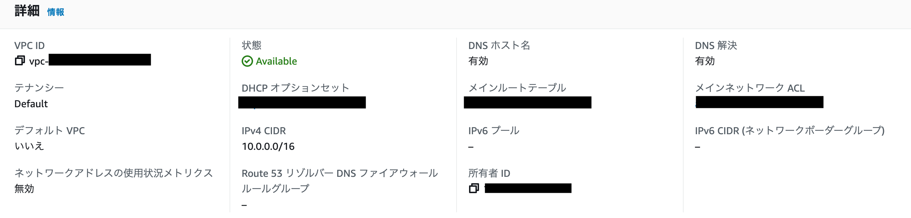
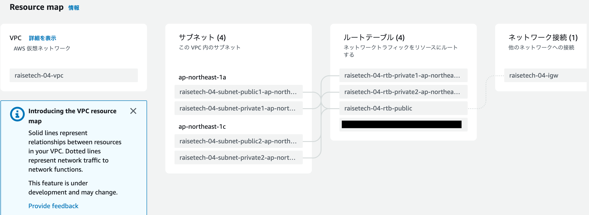
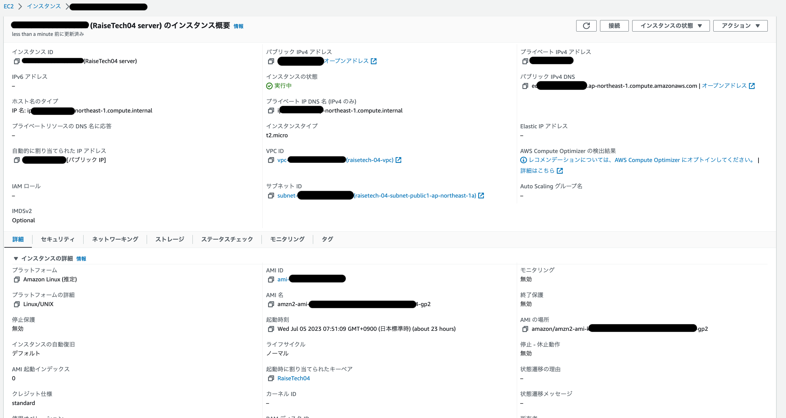
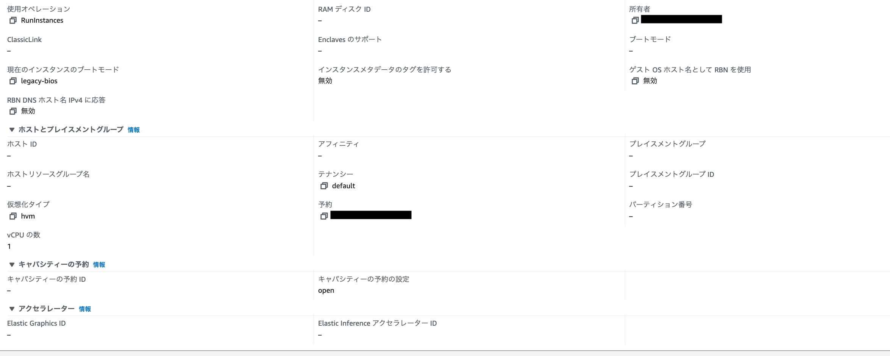
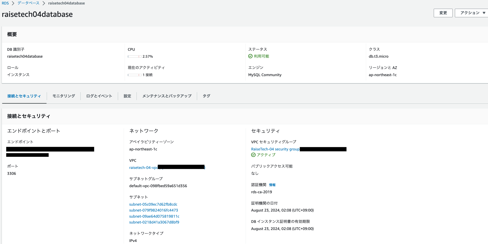
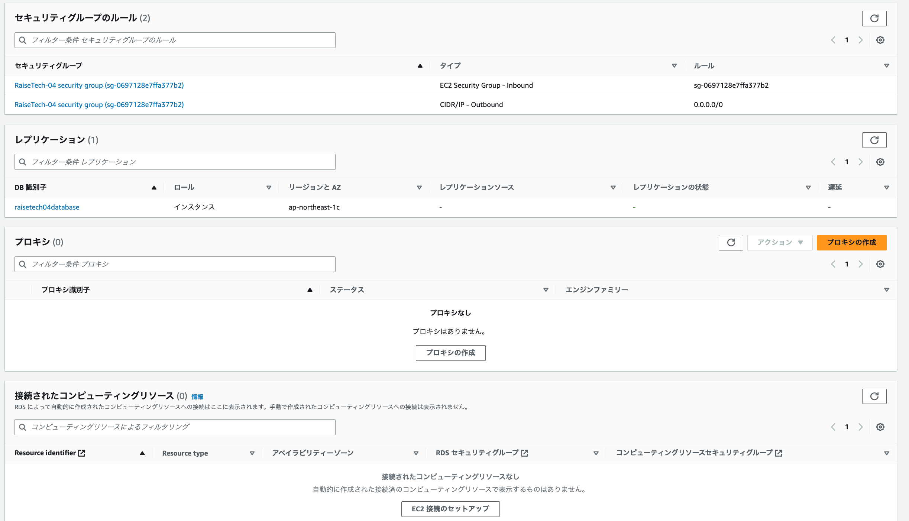
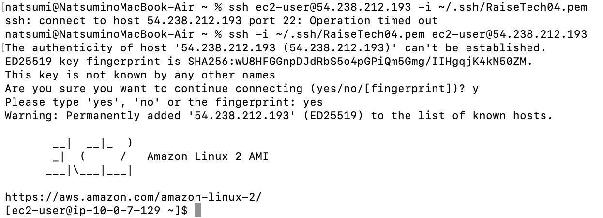
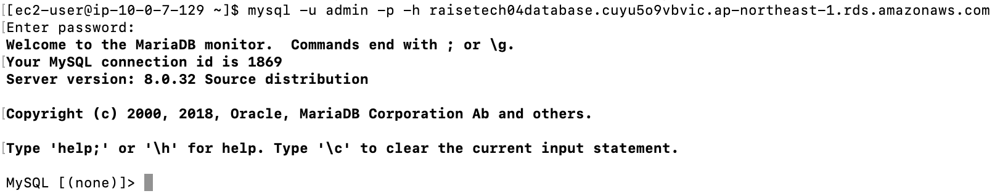

#### 1.AWS上に新しくVPCを作成する。
  - 「VPC作成」を押下
  - 作成するリソースは「VPCなど」
  - 名前タグは「raisetech-04-vpc」
  - IPv4 CIDRブロックは「10.0.0.0/16」を指定、IPv6 CIDRブロックは「なし」
  - AZの数は2、パブリック・プライベートサブネットの数はそれぞれ2（どちらもデフォルト）
  - サブネットのCIDRブロックは「〜/20」（デフォルト）
  - NATゲートウェイはなし（デフォルト）
  - VPCエンドポイントはなし
  - DNSオプションは「DNSホスト名を有効化」「DNS解決を有効化」両方選択（デフォルト）

  
  

#### 2.作成したVPCにEC2インスタンスを作成する。（public）
  - 「インスタンスを起動」を押下
  - 名前とタグは「RaiseTech04 server」
  - アプリケーションおよび OS イメージ (Amazon マシンイメージ)は「Amazon Linux 2023 AMI」（無料利用枠、デフォルト）
  - インスタンスタイプは「t2.micro」（無料利用枠、デフォルト）
  - キーペアのタイプは「RSA」、プライベートキーファイル形式は「.pem」（デフォルト）
  - ネットワーク設定　VPCは1で作成したもの、サブネットはpublic-1a、パブリックIPの自動割り当ては「有効化」
  - ファイアウォールは、既存のセキュリティグループ（RaiseTech-04 security group）
  - ストレージ設定は「1xGiB gp3」（デフォルト）

  
  

#### 3.作成したVPCにRDSを作成する（private）
  - 「データベースの作成」を押下
  - 作成方法は「標準作成」
  - エンジンは「MySQL」
  - テンプレートは「無料利用枠」
  - マスターユーザー名とパスワード設定
  - DB インスタンス識別子は「raisetech04database」
  - ストレージタイプは「汎用 SSD (gp2)」、ストレージ割り当ては「20」GiB、ストレージの自動スケーリングのチェックは外す
  - 「EC2コンピューティングリソースに接続しない」を選択（自分で接続する）
  - VPCは1で作成したもの
  - パブリックアクセスはなし

  
  

#### 4. ローカル環境のターミナルからEC2に接続する。
  - ターミナルを起動
  - ~/.sshディレクトリを作成
  - ダウンロードしたpemを~/.ssh配下へ移動
  - `chmod 600 ~/.ssh/RaiseTech04.pem`でパーミッションを変更
  - `ssh -i ~/.ssh/RaiseTech04.pem ec2-user@ec2のグローバルIP` でEC2にSSH接続

  

#### 5. EC2からRDSに接続し、MySQLへのアクセスを確認する。
  - `sudo yum install mysql`でMySQLをインストール
  - `mysql -u admin -p -h RDSのエンドポイント` でRDSに接続
  - エラーが出たため、EC2からRDSに接続するために、セキュリティグループのインバウンドのソースをEC2のセキュリティグループのIDのものを追加→成功！

  
